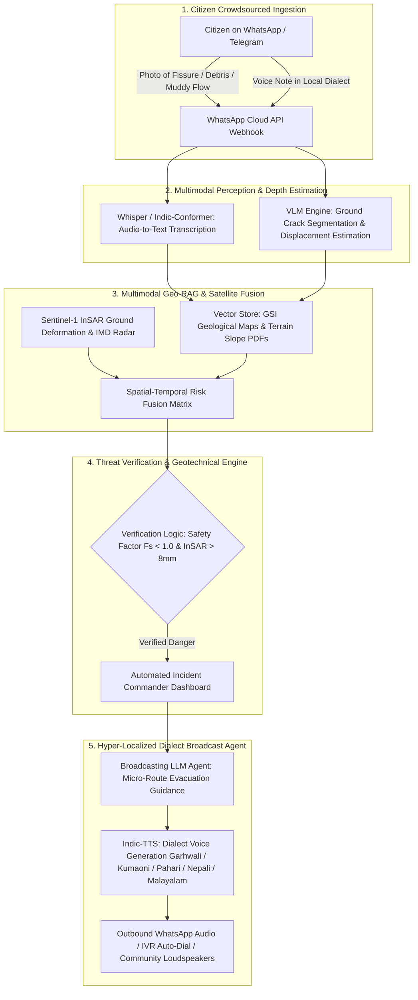
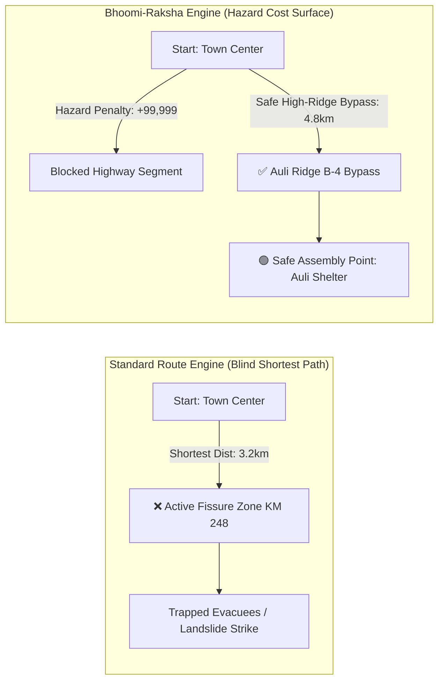

# ??? Bhoomi-Raksha (Geo-Rakshak AI)
### Crowdsourced Multimodal Sensor & Vision-RAG Landslide and Flash-Flood Early Warning Engine
**Smart India Hackathon (SIH) Theme**: Ministry of Earth Sciences / Disaster Management  
**Problem Statement**: Mountainous terrains suffer from rapid landslides, but official sensor stations are sparse, leaving rural populations unalerted.

---

## ?? The Winning GenAI Moat



### Key Differentiators vs. Naive Rainfall Dashboards:
1. **Multimodal Citizen Sensor Mesh**: Turns 100M+ smartphones in Himalayan and Western Ghats villages into real-time geotechnical sensor nodes via WhatsApp ($0 hardware cost).
2. **VLM Soil Displacement & Turbidity Estimation**: Vision-Language Model estimates fissure depth (cm), soil saturation ratio ($S_r$), and stream sediment turbidity from citizen photos.
3. **Geo-RAG & Satellite InSAR Fusion**: Fuses Geological Survey of India (GSI) 1:50,000 vulnerability maps, infinite slope stability models ($F_s$), and Copernicus Sentinel-1 InSAR millimeter-level surface creep.
4. **Dynamic Pathfinding & Evacuation Routing Engine**: Solves the critical flaw where standard Google Maps blindly routes people into active hazard zones during disasters. Uses a dynamic **Hazard Cost Surface Algorithm** on OpenStreetMap/NetworkX graphs to recalculate safe bypasses to high-ridge shelters in real-time.
5. **Hyper-Localized Regional Dialect Voice Alerts**: Generates synthesized audio evacuation voice notes in **Garhwali**, **Kumaoni**, **Pahari**, **Nepali**, **Malayalam**, and **Hindi** with specific ridge routing (avoiding local ravines/nallahs).

---

## 🗺️ Dynamic Pathfinding & Hazard Cost Surface Engine

> **The Problem with Standard Maps**: Standard navigation systems (like Google Maps) calculate routes solely based on travel time and static road speeds. During a landslide, this routes evacuees directly through collapsing road cuts (e.g., NH-58 Marwari Ward 9) because they appear as the shortest path.



### Hazard Cost Surface Algorithm
Every road edge $e$ is weighted dynamically:
$$C(e) = \text{Length}(e) \times \left(1 + \sum w_i \cdot H_i\right) + P_{\text{impassable}}$$
- $H_1$: VLM Fissure Depth & Buckling Severity
- $H_2$: Copernicus InSAR ground creep rate (mm/yr)
- $H_3$: Slope instability factor ($F_s < 1.0$)
- $P_{\text{impassable}}$: Barrier penalty ($+99,999$) when fissure depth $> 5\text{cm}$ or turbidity $> 70\%$

---

## 🚀 Quick Start Guide

### Step 1: Install Dependencies
```bash
pip install -r server/requirements.txt
```

### Step 2: Run Automated Test Suite
```bash
python server/test_bhoomi_raksha.py
```

### Step 3: Launch Command Server
```bash
python server/app.py
```
Open your browser at **`http://localhost:5000`** to view the live Interactive Control Room.

---

## 📂 Repository Structure

```
├── dashboard/               # Frontend Control Room & Simulation UI
│   ├── index.html           # Fullscreen Map Hero with Glassmorphic HUD
│   ├── style.css            # Apple Titanium Frosted Dark Glass Theme
│   └── app.js               # Leaflet GIS Map, Routing Engine & Polling Controller
│
├── server/                  # Backend GenAI & Geotechnical Engines
│   ├── app.py               # Flask REST API & Webhook Controller
│   ├── routing_engine.py    # NetworkX Hazard Cost Surface Pathfinding
│   ├── geo_rag.py           # GSI Knowledge Base & Geotechnical Safety Factor (Fs)
│   ├── vlm_engine.py        # Vision-Language Model for Fissure Depth & Turbidity
│   ├── broadcast_agent.py   # Dialect Translation & Text-to-Speech Voice Synthesizer
│   ├── scoring_engine.py    # Multi-Factor Risk Fusion (VLM + InSAR + Fs + Rain)
│   ├── test_bhoomi_raksha.py# Automated Unit & Integration test suite
│   └── static/audio/        # Generated Dialect Voice Note MP3 files
│
└── contracts/               # Data schema contracts
```

---

## 🧪 4 Interactive Demonstration Scenarios

1. **🔴 Scenario 1: Chamoli - Joshimath Tension Crack**
   - *VLM Analysis*: 8.4 cm fissure depth, 82% soil saturation, Main Central Thrust (MCT) shear zone.
   - *Routing*: Blocks NH-58 Marwari Ward 9, routes evacuees via Auli High Ridge B-4 Bypass.
   - *Broadcast*: Audio synthesized in **Garhwali** directing evacuation towards Auli high ridge path.
2. **🔴 Scenario 2: Wayanad - Chooralmala Debris Torrent**
   - *VLM Analysis*: 94.8% sediment slurry turbidity, debris torrent precursor.
   - *Routing*: Blocks Chooralmala Valley Rd, routes evacuees via Meppadi Upper Ridgeline.
   - *Broadcast*: Audio synthesized in **Malayalam** directing evacuation to Meppadi highland camp.
3. **🟠 Scenario 3: Shimla - Urban Retaining Wall Subsidence**
   - *VLM Analysis*: 16.2° downhill wall deflection, asphalt buckling under construction surcharge.
   - *Routing*: Sluggish warning on Circular Rd, routes via Ridge Bypass.
   - *Broadcast*: Audio synthesized in **Pahari** routing traffic away from Krishna Nagar ravine.
4. **🟢 Scenario 4: Calibration & False Alarm**
   - *VLM Analysis*: 0.0 cm displacement, dry asphalt, $F_s = 2.1$ (Stable).
   - *Routing*: All corridors Green / Safe.

---

## 📡 API Contract Highlights

- `GET /api/dashboard/status` ➔ Full real-time telemetry, risk scores, GSI profiles, and dynamic routes.
- `POST /api/routing/navigate` ➔ Compares standard shortest path vs Bhoomi-Raksha hazard-penalized safe route.
- `POST /api/scenario/trigger` ➔ Switch between disaster and calibration scenarios.
- `POST /api/citizen/report` ➔ Ingest citizen photo, voice note, and GPS coordinates.
- `POST /api/broadcast/generate` ➔ Generate custom voice broadcast in selected dialect.
- `POST /api/action/operator` ➔ Incident Commander dispatch & false-alarm audit logging.

