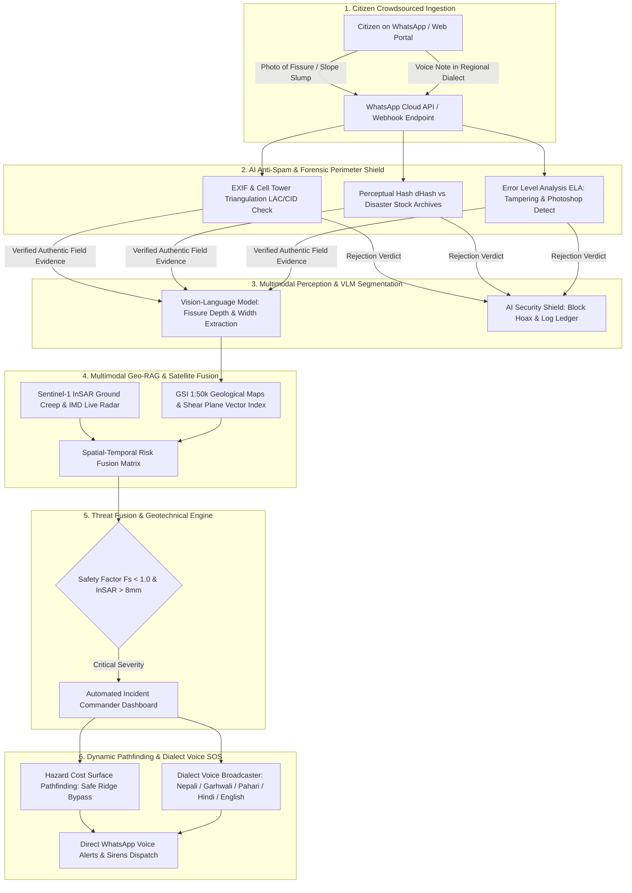
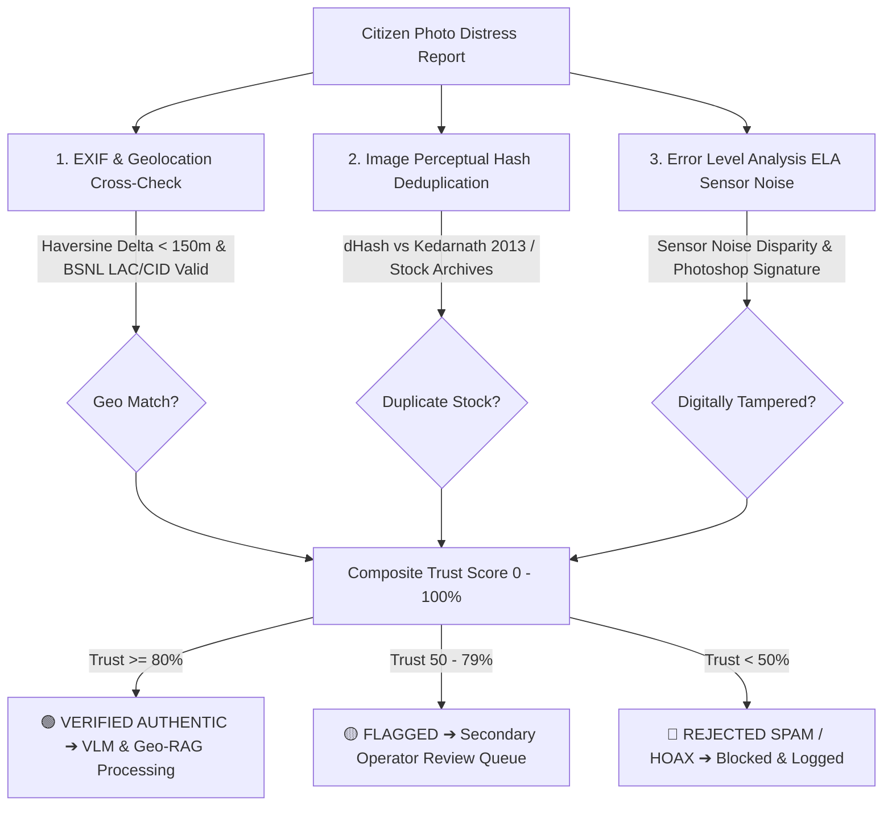
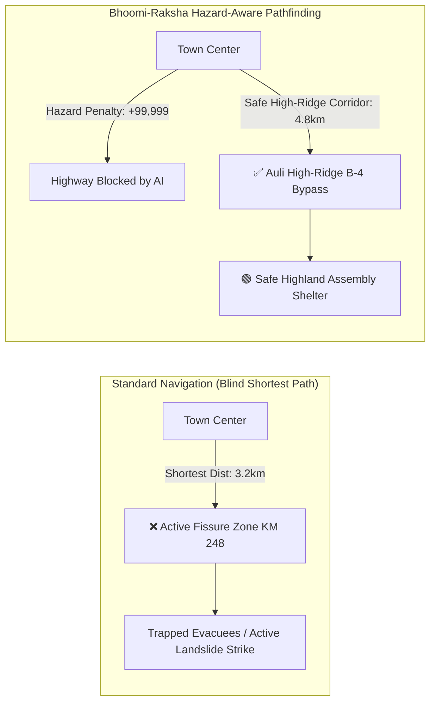

# 🏔️ Bhoomi-Raksha (Geo-Rakshak AI)
### Crowdsourced Multimodal Sensor & Vision-RAG Landslide and Flash-Flood Early Warning Engine
**Smart India Hackathon (SIH) Theme**: Ministry of Earth Sciences (MoES) / Disaster Management  
**Problem Statement**: Mountainous Himalayan terrains suffer from rapid landslides and flash floods, but official sensor stations are sparse, leaving rural populations unalerted.

---

## 💡 The Winning GenAI Moat



### Key Differentiators vs. Naive Rainfall Dashboards:
1. **Multimodal Citizen Sensor Mesh**: Turns 100M+ everyday smartphones across Himalayan villages into geotechnical sensor nodes via WhatsApp ($0 hardware capital expenditure).
2. **VLM Geotechnical Damage Segmentation**: Vision-Language Model extracts exact longitudinal fissure depth (cm), width (cm), soil saturation ratio ($S_r$), and stream sediment turbidity from citizen photos.
3. **Forensic AI Anti-Spam & Authenticity Shield**: Prevents disaster response diversion by validating EXIF GPS, cell tower telecom circle (LAC/CID), Error Level Analysis (ELA) camera sensor noise, and perceptual duplicate hashing (dHash) against historical disaster stock photo archives (e.g. Kedarnath 2013 re-uploads).
4. **Geo-RAG & Satellite InSAR Fusion**: Fuses Geological Survey of India (GSI) 1:50,000 vulnerability profiles, infinite slope stability models ($F_s$), and Copernicus Sentinel-1 InSAR millimeter-level displacement data.
5. **Dynamic Pathfinding & Hazard Cost Surface Routing**: Standard navigation apps (e.g. Google Maps) blindly route evacuees into active landslide strike cuts because they only optimize for static distance. Bhoomi-Raksha applies a dynamic **Hazard Cost Surface Algorithm** on OpenStreetMap/NetworkX graphs to recalculate safe bypasses to high-ridge shelters in real-time.
6. **Hyper-Localized Himalayan Dialect Voice Broadcasts**: Generates synthesized evacuation voice notes in **Nepali (Darjeeling / Sikkim)**, **Garhwali (Chamoli / Uttarakhand)**, **Pahari (Shimla / HP)**, **Hindi**, and **English**, directing citizens to ridge corridors while warning them away from sinking gullies.

---

## 🛡️ AI Hallucination & Anti-Spam Protocol (Perimeter Defense)

> *"Crowdsourced disaster networks fail in practice because of spam, viral social media forwards, recycled historical disaster photos, and internet pranks. Bhoomi-Raksha verifies every upload at the physical and cryptographic sensor layer before feeding it into the GenAI engine."*



### Verification Checks:
- **EXIF & Geolocation Delta**: Validates timestamp freshness, device camera model, GPS coordinates, and cross-references against local telecom circle cellular towers (LAC/CID).
- **Perceptual dHash / pHash Deduplication**: Scans incoming frames against historical disaster archives to instantly catch recycled disaster photos (e.g., 98.4% match to Kedarnath 2013 photo).
- **Error Level Analysis (ELA)**: Detects compression quantization anomalies, Photoshop signatures, and digitally spliced road cracks.

---

## 🗺️ Dynamic Pathfinding: Standard Maps vs. Bhoomi-Raksha

> **The Flaw in Conventional Navigation**: Standard GPS systems (like Google Maps) calculate routes solely based on shortest travel time. During active slope failures, this leads evacuees directly into fatal rockfall zones (e.g., NH-58 Marwari Ward 9) because the highway appears open on static maps.



### Hazard Cost Surface Algorithm:
Every road network edge $e$ is weighted dynamically:
$$C(e) = \text{Length}(e) \times \left(1 + \sum w_i \cdot H_i\right) + P_{\text{impassable}}$$
- $H_1$: VLM Fissure Depth & Buckling Severity ($> 5\text{cm} \implies \text{CRITICAL}$)
- $H_2$: Copernicus Sentinel-1 InSAR surface creep rate ($\text{mm/yr}$)
- $H_3$: Factor of Safety threshold ($F_s < 1.0 \implies \text{Imminent Shear}$)
- $P_{\text{impassable}}$: Barrier penalty ($+99,999$) forcing Dijkstra pathfinding uphill toward bedrock ridges.

---

## 📱 Two Interactive Interfaces for Hackathon Demonstrations

### 1. Incident Commander Control Room (`http://localhost:5000/`)
- **Fullscreen Leaflet GIS Map**: Displays color-coded road networks, InSAR ground creep overlays, safe evacuation shelters, and live GPS pins.
- **Dynamic Route Visualizer**: Compares the naive Google Maps route (red dashed line) vs. Bhoomi-Raksha verified corridor (green glowing polyline).
- **Emergency Action Bar**: One-click **"BROADCAST VOICE SOS & SIRENS"** button dispatching real-time WhatsApp alerts.
- **Live SOS Modal**: Pops up instantly when a citizen distress photo arrives, displaying the photo thumbnail, VLM crack depth, and anti-spam verification badge.

### 2. Citizen WhatsApp Emergency Portal (`http://localhost:5000/citizen`)
- **WhatsApp UI Experience**: Works directly in the browser or via Meta Cloud API on mobile.
- **📷 Instant Photo Attachment Drawer**:
  - 📸 *Authentic Field Fissure (Joshimath)*: Passes verification (99% Trust, 8.4cm depth).
  - ⚠️ *Recycled Stock Photo (Kedarnath 2013)*: Triggers instant anti-spam rejection (98.4% archive duplicate).
  - 🚫 *Photoshop Splice*: Catches digital tampering and ELA compression anomalies.
  - 📁 *Device Upload*: Allows uploading any custom field photo from your laptop or phone.
- **Rich AI Vision & Anti-Spam Card in Chat**: Chat feed renders the geotechnical metrics (fissure depth, width, saturation), forensic telecom checks, and designated evacuation corridor.

---

## 🧪 Interactive Demonstration Scenarios

1. **🔴 Chamoli - Joshimath Tension Scarp (Uttarakhand)**
   - *Geology*: Main Central Thrust (MCT) shear zone, fractured Gneiss.
   - *VLM Analysis*: 8.4 cm fissure depth, 14.2 cm width, 82% soil saturation.
   - *Spam Filter*: 99.0% Trust (`VERIFIED_AUTHENTIC` • Ward 9 BSNL Tower LAC:2481).
   - *Routing*: Blocks NH-58 Marwari Ward 9, routes via Auli High Ridge B-4 Bypass.
   - *Dialect Voice*: **Garhwali** audio dispatch (*"सावधान! तुम्हारा इलाका मा भारी भूस्खलन को खतरा च..."*).

2. **🟠 Shimla - Retaining Wall Bulge & Subsidence (Himachal Pradesh)**
   - *Geology*: Jutogh Quartzite Bedrock, active subsurface toe creep.
   - *VLM Analysis*: Retaining wall outward deflection with shear cracks, 7.1 cm depth.
   - *Routing*: Warns of Cart Road sinking, routes via The Ridge Municipal Plaza bypass.
   - *Dialect Voice*: **Pahari** audio dispatch (*"चेतावनी! ज़मीन खिसकणे रा भारी ख़तरा ऐ..."*).

3. **🔵 Darjeeling / Sikkim - Teesta Valley Landslide & Slurry (Eastern Himalayas)**
   - *Geology*: Daling group phyllites, severe toe erosion along Teesta River.
   - *VLM Analysis*: 6.8 cm depth, 88% sediment slurry turbidity.
   - *Routing*: Blocks Paglajhora sinking section on NH-10, routes via Kurseong Upper Ridge.
   - *Dialect Voice*: **Nepali** audio dispatch (*"आपत्कालीन चेतावनी! तपाईंको क्षेत्रमा गम्भीर पहिरोको उच्च जोखिम छ..."*).

4. **🟢 Baseline Highway Survey (Calibration / Safe)**
   - *Telemetry*: 0.0 cm fissure, dry asphalt, $F_s = 2.1$ (Stable).
   - *Routing*: All corridors Green / Clear.

---

## 🚀 Quick Start Guide

### Prerequisites
- Python 3.10+ installed
- Modern web browser (Chrome, Edge, Firefox)

### Step 1: Clone and Install Dependencies
```bash
git clone https://github.com/Kritika200520/SIH.git
cd SIH
pip install -r server/requirements.txt
```

### Step 2: Run Automated Unit Tests
Verify all 6 core subsystems (VLM, InSAR fusion, Dynamic Pathfinding, Dialect TTS, Anti-Spam ELA):
```bash
python server/test_bhoomi_raksha.py
```

### Step 3: Launch the Command Server
```bash
python server/app.py
```

### Step 4: Open Demo Interfaces
- **Command Center Dashboard**: http://localhost:5000
- **Citizen WhatsApp Portal**: http://localhost:5000/citizen

---

## 📂 Repository Structure

```
├── dashboard/               # Frontend Control Room & Citizen Portal
│   ├── index.html           # Fullscreen GIS Map Hero with HUD & SOS Modal
│   ├── citizen.html         # Citizen WhatsApp Web Portal & AI Vision Chat
│   ├── app.js               # Leaflet GIS Map, Pathfinding & SOS Polling
│   ├── style.css            # Dark Titanium Glass Theme
│   └── styles.css           # Utility Stylesheets
│
├── server/                  # Backend GenAI, VLM & Geotechnical Engines
│   ├── app.py               # Flask REST API, Cloudflare Tunnel & SOS Endpoints
│   ├── broadcast_agent.py   # Dialect Synthesis (Nepali, Garhwali, Pahari, Hindi, English)
│   ├── geo_rag.py           # GSI Geological Profiles & Safety Factor (Fs) Models
│   ├── predictive_engine.py # AI Slope Timeline & Risk Estimation
│   ├── routing_engine.py    # NetworkX Hazard Cost Surface Dynamic Pathfinding
│   ├── scoring_engine.py    # Threat Fusion (VLM + InSAR + Fs + IMD Rainfall)
│   ├── spam_filter.py       # Computer Vision ELA & Perceptual dHash Anti-Spam
│   ├── vlm_engine.py        # Vision-Language Model Damage Segmentation
│   ├── weather_service.py   # Live Rainfall & IMD Meteorological Integration
│   ├── whatsapp_service.py  # Meta Cloud API Outbound Evacuation Alerts
│   ├── test_bhoomi_raksha.py# Automated Regression & Subsystem Test Suite
│   └── static/audio/        # Synthesized Regional Dialect Voice Notes (.mp3)
│
└── README.md                # Project Architecture, Documentation & Pitch Guide
```

---

## 📡 REST API Endpoints

| Endpoint | Method | Description |
| :--- | :---: | :--- |
| `/api/dashboard/status` | `GET` | Fetches live telemetry, composite risk score, event logs, and active alerts |
| `/api/citizen/sos` | `POST` | Ingests citizen distress text/photo, runs VLM segmentation & ELA anti-spam |
| `/api/broadcast/generate` | `POST` | Generates dialect evacuation audio script (Nepali, Garhwali, Pahari, etc.) |
| `/api/routing/navigate` | `POST` | Calculates naive Google Maps path vs. Bhoomi-Raksha hazard-penalized route |
| `/api/scenario/trigger` | `POST` | Triggers disaster scenario (Chamoli, Shimla, Darjeeling, Baseline) |
| `/api/spam-filter/verify` | `POST` | Runs EXIF, cell tower LAC/CID, dHash duplicate check, and ELA analysis |
| `/api/action/operator` | `POST` | Dispatches dialect sirens & evacuation routes to registered WhatsApp phones |

---

## 👥 Hackathon Presentation Summary (The 30-Second Pitch)

> *"Bhoomi-Raksha bridges the critical gap between space-age satellite data and ground-level rural survival. By combining Copernicus InSAR radar, smartphone Vision-Language Models, and a forensic Anti-Spam Shield, we filter out fake disaster forwards and calculate safe mountain bypass routes before people get trapped. Best of all, alerts reach citizens instantly on WhatsApp in their mother tongue—saving lives in the crucial golden hour with zero app installation."*


