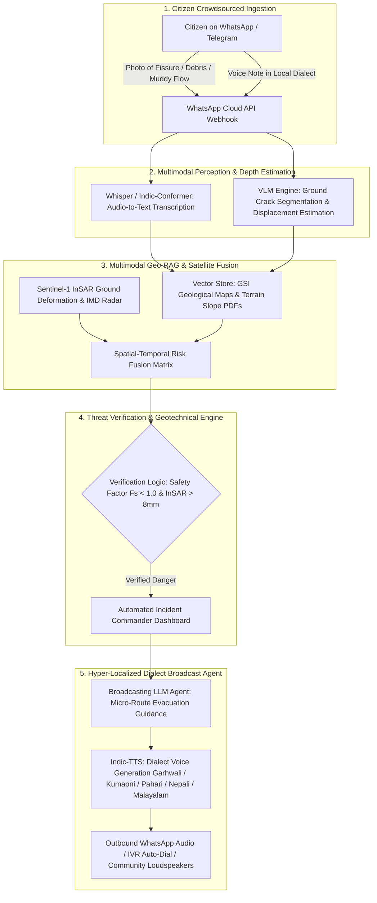

# ??? Bhoomi-Raksha (Geo-Rakshak AI)
### Crowdsourced Multimodal Sensor & Vision-RAG Landslide and Flash-Flood Early Warning Engine
**Smart India Hackathon (SIH) Theme**: Ministry of Earth Sciences / Disaster Management  
**Problem Statement**: Mountainous terrains suffer from rapid landslides, but official sensor stations are sparse, leaving rural populations unalerted.

---

## ?? The Winning GenAI Moat



### Key Differentiators vs. Naive Rainfall Dashboards:
1. **Multimodal Citizen Sensor Mesh**: Turns 100M+ smartphones in Himalayan and Western Ghats villages into real-time geotechnical sensor nodes via WhatsApp ($0 hardware cost).
2. **VLM Soil Displacement & Turbidity Estimation**: Vision-Language Model estimates fissure depth (cm), soil saturation ratio ($S_r$), and stream sediment turbidity from citizen photos.
3. **Geo-RAG & Satellite InSAR Fusion**: Fuses Geological Survey of India (GSI) 1:50,000 vulnerability maps, infinite slope stability models ($F_s$), and Copernicus Sentinel-1 InSAR millimeter-level surface creep.
4. **Hyper-Localized Regional Dialect Voice Alerts**: Generates synthesized audio evacuation voice notes in **Garhwali**, **Kumaoni**, **Pahari**, **Nepali**, **Malayalam**, and **Hindi** with specific ridge routing (avoiding local ravines/nallahs).

---

## ?? Quick Start Guide

### Step 1: Install Dependencies
```bash
pip install -r server/requirements.txt
```

### Step 2: Run Automated Test Suite
```bash
python server/test_bhoomi_raksha.py
```

### Step 3: Launch Command Server
```bash
python server/app.py
```
Open your browser at **`http://localhost:5000`** to view the live Interactive Control Room.

---

## ?? Repository Structure

```
??? dashboard/               # Frontend Control Room & Simulation UI
?   ??? index.html           # 4-Zone Cyber-Geological Command Center
?   ??? style.css            # Dark glassmorphic responsive styles
?   ??? app.js               # Leaflet GIS Map, Audio Player, Polling Controller
?
??? server/                  # Backend GenAI & Geotechnical Engines
?   ??? app.py               # Flask REST API & Webhook Controller
?   ??? geo_rag.py           # GSI Knowledge Base & Geotechnical Safety Factor (Fs)
?   ??? vlm_engine.py        # Vision-Language Model for Fissure Depth & Turbidity
?   ??? broadcast_agent.py   # Dialect Translation & Text-to-Speech Voice Synthesizer
?   ??? scoring_engine.py    # Multi-Factor Risk Fusion (VLM + InSAR + Fs + Rain)
?   ??? test_bhoomi_raksha.py# Unit & Integration test suite
?   ??? static/audio/        # Generated Dialect Voice Note MP3 files
?
??? contracts/               # Data schema contracts
```

---

## ?? 4 Interactive Demonstration Scenarios

1. **?? Scenario 1: Chamoli - Joshimath Tension Crack**
   - *VLM Analysis*: 8.4 cm fissure depth, 82% soil saturation, Main Central Thrust (MCT) shear zone.
   - *InSAR Shift*: +14.8 mm/yr creep.
   - *Broadcast*: Audio synthesized in **Garhwali** directing evacuation towards Auli high ridge path.
2. **?? Scenario 2: Wayanad - Chooralmala Debris Torrent**
   - *VLM Analysis*: 94.8% sediment slurry turbidity, debris torrent precursor.
   - *InSAR Shift*: +18.6 mm/yr creep, 145mm rainfall in 24h.
   - *Broadcast*: Audio synthesized in **Malayalam** directing evacuation to Meppadi highland camp.
3. **?? Scenario 3: Shimla - Urban Retaining Wall Subsidence**
   - *VLM Analysis*: 16.2? downhill wall deflection, asphalt buckling under construction surcharge.
   - *InSAR Shift*: +11.5 mm/yr creep.
   - *Broadcast*: Audio synthesized in **Pahari** routing traffic away from Krishna Nagar ravine.
4. **?? Scenario 4: Calibration & False Alarm**
   - *VLM Analysis*: 0.0 cm displacement, dry asphalt, $F_s = 2.1$ (Stable).

---

## ?? API Contract Highlights

- `GET /api/dashboard/status` ? Full real-time telemetry, risk scores, and GSI profiles.
- `POST /api/scenario/trigger` ? Switch between disaster and calibration scenarios.
- `POST /api/citizen/report` ? Ingest citizen photo, voice note, and GPS coordinates.
- `POST /api/broadcast/generate` ? Generate custom voice broadcast in selected dialect.
- `POST /api/action/operator` ? Incident Commander dispatch & false-alarm audit logging.
